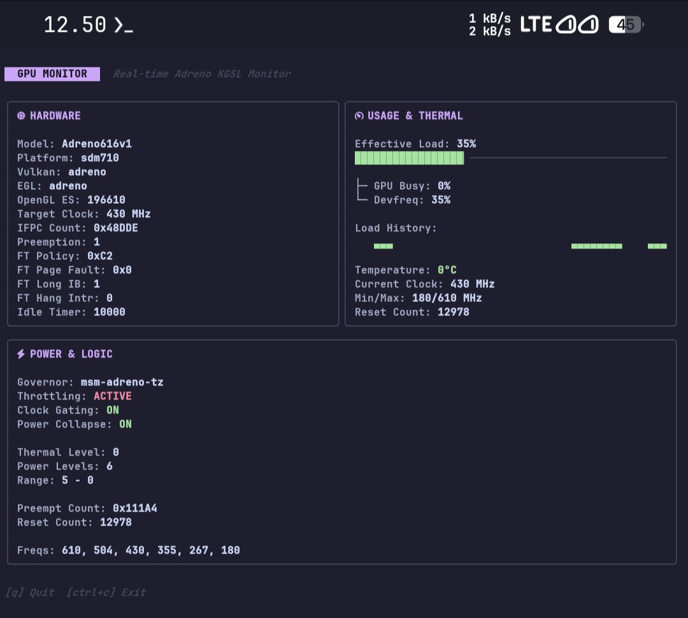

# agtop ⚡

[](https://go.dev/)
[](LICENSE)
[](https://termux.dev/)
[](https://www.android.com/)



`agtop` (Android GPU Monitor) is a real-time GPU monitoring tool for Android devices running in the terminal. Built using **Go (Golang)** with a *Modern, Minimalist, and Btop-style* TUI (Terminal User Interface).

Currently, `agtop` is optimized for monitoring **Qualcomm Adreno** GPUs (via kgsl), with an architecture prepared for support of other GPUs (Mali, PowerVR, Immortalis) in the future.

## Key Features

*   **Modern TUI Interface:** Uses the eye-friendly *Catppuccin Mocha* color palette.
*   **Smooth Visuals:** Equipped with *Sparkline* for GPU load history and fine-grained *Progress Bars* in `btop` style.
*   **Responsive Layout:** *Smart Grid* display that automatically adapts to your terminal size (supporting Desktop/Wide, Tablet, and Mobile/Narrow views).
*   **Hardware & Driver Details:** Displays GPU Model, SoC Platform, Vulkan, EGL, and OpenGL ES versions.
*   **Real-Time Monitoring:**
    *   Effective Load (GPU Busy & Devfreq Load)
    *   Temperature
    *   Clock Frequencies (Current, Min, Max, Target)
*   **Power & Logic Stats:** Displays Governor status, Throttling, Hardware Clock Gating, Idle Power Collapse, Reset Count, and available Frequencies.

## System Requirements

*   **OS:** Android (run via Termux, ADB Shell, or SSH).
*   **Access:** **Root** (su) access is recommended as most sysfs parameters in `/sys/class/kgsl/...` require elevated privileges to read.
*   **Go:** Version 1.21 or newer (if you want to compile it yourself).

## Installation & Build

### Quick Install (Recommended)

Install the latest binary directly from GitHub releases:

```bash
curl -fsSL https://raw.githubusercontent.com/HanSoBored/agtop/main/installation/install.sh | bash
```

**Note:** Make sure `curl` is installed on your system.

- **Linux/Android:** `sudo apt install curl` or `pkg install curl` (Termux)
- **macOS:** `brew install curl`

### Build from Source

1. Clone this repository:
   ```bash
   git clone https://github.com/HanSoBored/agtop.git
   cd agtop
   ```

2. Download required dependencies (Bubbletea & Lipgloss):
   ```bash
   go mod tidy
   ```

3. Build the application:
   ```bash
   go build -o agtop cmd/agtop/main.go
   ```

## Usage

Run the built binary (make sure to run it with root/su access if using Termux to read sensor data):

```bash
# In Termux (requires root)
su -c ./agtop

# Or via ADB Shell
adb push agtop /data/local/tmp/
adb shell
cd /data/local/tmp/
chmod +x agtop
./agtop
```

**TUI Controls:**
*   Press `q` or `Ctrl+C` to exit the application.

## Roadmap (To-Do)

- [ ] Implement *sysfs mapping* for ARM Mali GPUs.
- [ ] Implement *sysfs mapping* for PowerVR GPUs.
- [ ] Implement *sysfs mapping* for Immortalis GPUs.

## Contributing

Pull requests are very welcome! For major changes, please open an *issue* first to discuss what you would like to change. If you have a device with Mali or PowerVR GPUs and want to help complete the *sysfs paths*, feel free to contribute in the `internal/gpu/providers/` folder.

## License

Distributed under the GNU GPLv3 License. See the `LICENSE` file for more information.
